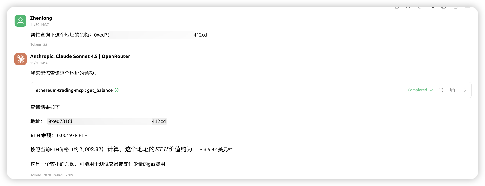
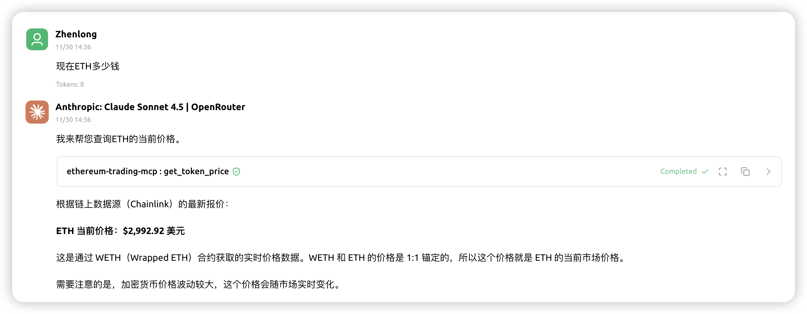

# Ethereum Trading MCP Server

A Model Context Protocol (MCP) server built in Rust that enables AI agents to query blockchain data and simulate token swaps on Ethereum.

## Features

- **`get_balance`** - Query ETH and ERC20 token balances for any wallet address
- **`get_token_price`** - Get current token prices in USD or ETH from on-chain sources (Chainlink, Uniswap)
- **`swap_tokens`** - Simulate Uniswap V2/V3 swaps using token symbols (WETH, ETH, USDC, USDT, DAI, WBTC, LINK, UNI)

## Prerequisites

- Rust 1.90+ (install via [rustup](https://rustup.rs/))
- An Ethereum RPC endpoint (e.g., [Alchemy](https://www.alchemy.com/), [Infura](https://infura.io/), or a public endpoint)
- A wallet private key for swap simulations

## Setup

### 1. Clone the repository

```bash
git clone https://github.com/yourusername/ethereum-trading-mcp.git
cd ethereum-trading-mcp
```

### 2. Set environment variables

Create a `.env.dev` file in the project root:

```bash
# Required
export ETHEREUM_RPC_URL="https://mainnet.infura.io/v3/YOUR_API_KEY"
export ETHEREUM_PRIVATE_KEY="0x..."

# Optional
ETHEREUM_CHAIN_ID=1
LOG_LEVEL=info
```

> ⚠️ **Security Note**: Never commit your private key. The key is only used locally for transaction signing and simulation.

### 3. Build the project

```bash
cargo build --release
```

### 4. Run the server

```bash
./target/release/ethereum-trading-mcp
```

The server communicates via stdio and follows the MCP protocol.

## Testing

### 1. Run the test suite

```bash
cargo test
```

### 2. Test with MCP Inspector

``` bash
npx @modelcontextprotocol/inspector --config mcp.dev.json \
  -e ETHEREUM_RPC_URL="https://mainnet.infura.io/v3/YOUR_API_KEY" \
  -e ETHEREUM_PRIVATE_KEY="0x..."
```

## Project Structure

```
src/
├── main.rs                 # Application entry point
├── lib.rs                  # Library root, re-exports
├── config/
│   └── mod.rs              # Configuration management
├── error/
│   └── mod.rs              # Error types and handling
├── mcp/
│   ├── mod.rs              # MCP module root
│   └── server.rs           # MCP server implementation
├── ethereum/
│   ├── mod.rs              # Ethereum module root
│   ├── client.rs           # Ethereum RPC client
│   ├── wallet.rs           # Wallet management
│   └── contracts/
│       ├── mod.rs          # Contract module root
│       ├── erc20.rs        # ERC20 ABI
│       ├── uniswap_v2.rs   # Uniswap V2 contracts
│       ├── uniswap_v3.rs   # Uniswap V3 contracts
│       └── chainlink.rs    # Chainlink price feeds
├── services/
│   ├── mod.rs              # Services module root
│   ├── balance.rs          # Balance query logic
│   ├── price.rs            # Price fetching logic
│   └── swap.rs             # Swap simulation logic
└── types/
    ├── mod.rs              # Types module root
    ├── token.rs            # Token-related types
    └── swap.rs             # Swap-related types
```

## API Reference

See [API Reference](./docs/api_reference.md) for detailed documentation on available tools.

## Screenshots

### get_balance


### get_token_price


### swap_tokens


## Integrations

- [Cherry Studio](https://cherrystudio.ai/): [Documentation](./docs/cherry_studio_intergration.md)

## Known Limitations

- **Mainnet Only**: Currently supports Ethereum mainnet only (chain ID 1)
- **Direct Swaps**: Multi-hop routing is limited to WETH as an intermediate token
- **Price Impact**: Price impact calculation is simplified; real DEX aggregators use more sophisticated methods
- **No Caching**: Token metadata and prices are fetched fresh each time
- **Single DEX**: Only supports Uniswap V2/V3; no aggregator integration

## License

MIT
